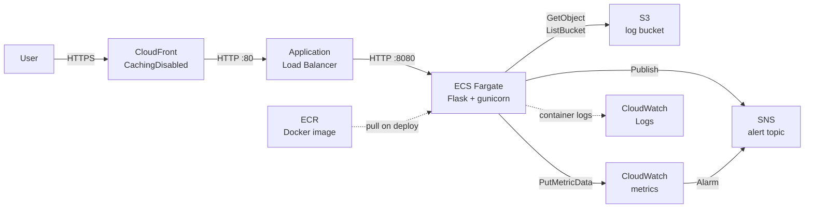

# Log Analytics Service

Reads the latest JSONL log file from S3, filters errors, and returns a summary. Exposes a CLI and an HTTP API. Deployed on AWS with ECS Fargate, ALB, and CloudFront via Terraform and GitHub Actions.

## Run locally

### Prerequisites

```bash
# install uv if you don't have it
curl -Ls https://astral.sh/uv/install.sh | sh

uv sync --extra dev
```

### CLI

```bash
# local file
uv run python -m app.main analyze --file app/tests/fixtures/sample.jsonl --threshold 3

# S3 (needs AWS credentials in environment)
uv run python -m app.main analyze --bucket my-logs --prefix logs/ --threshold 3

# filter by time window
uv run python -m app.main analyze --bucket my-logs --prefix logs/ --threshold 3 --since 2025-09-15T14:00:00Z
```

### HTTP server

```bash
uv run flask --app app.main run --port 8080

curl "http://localhost:8080/analyze?bucket=my-logs&prefix=logs/&threshold=3"
curl "http://localhost:8080/health"
```

### Docker

```bash
docker build -t log-analytics .
docker run -p 8080:8080 \
  -e AWS_ACCESS_KEY_ID=... \
  -e AWS_SECRET_ACCESS_KEY=... \
  -e AWS_DEFAULT_REGION=us-east-1 \
  log-analytics

curl "http://localhost:8080/analyze?bucket=my-logs&prefix=logs/&threshold=3"
```

## Tests

```bash
uv run --extra dev pytest app/tests/ -v
```

Tests cover: basic error count, alert at/below/above threshold, empty input, invalid JSON lines, `--since` filter, the sample fixture, and S3 client pagination and file selection.

## API

### GET /analyze

| Parameter   | Required | Description                                      |
|-------------|----------|--------------------------------------------------|
| `bucket`    | yes      | S3 bucket containing the JSONL logs              |
| `prefix`    | yes      | S3 key prefix to scan                            |
| `threshold` | yes      | Trigger alert when total errors >= this value    |
| `since`     | no       | Only count errors after this ISO 8601 timestamp  |

```json
{
  "total": 3,
  "byService": { "api": 1, "orders": 1, "billing": 1 },
  "alert": true
}
```

### GET /notify

Same parameters as `/analyze`. If `alert` is true, publishes the result to SNS.
Requires `SNS_TOPIC_ARN` environment variable - returns 501 if not set.

### GET /health

Returns `{"status": "ok"}`. Used by the ALB health check.

## Sample log format

```jsonl
{"ts":"2025-09-15T14:10:04Z","service":"api","level":"ERROR","msg":"500 internal server error","endpoint":"/checkout","latency_ms":2001}
{"ts":"2025-09-15T14:10:07Z","service":"orders","level":"INFO","msg":"order placed","orderId":"o-124"}
{"ts":"2025-09-15T14:10:09Z","service":"billing","level":"ERROR","msg":"foreign key constraint","orderId":"o-125"}
```

The service picks the **latest** `.jsonl` file under the given prefix by `LastModified` date.

## Infrastructure



- ECS Fargate in public subnets with `assign_public_ip = true` (avoids NAT gateway cost)
- ECS security group only accepts traffic from the ALB security group
- ALB health check on `/health`
- CloudFront with `CachingDisabled` policy (this is an API, not a static site)
- S3 remote state with versioning
- ECR lifecycle policy keeps the last 10 images
- Task role has least-privilege S3 access scoped to the logs bucket only
- Deployment circuit breaker with automatic rollback on failed deploys
- Container Insights enabled on the ECS cluster
- CloudWatch alarm on `AlertTriggered >= 1` forwards automatically to the SNS topic (no need to call `/notify`)

## Deploy

### One-time setup

**1. S3 state bucket**

```bash
aws s3 mb s3://log-analytics-service-tfstate-eu-west-1 --region eu-west-1
aws s3api put-bucket-versioning \
  --bucket log-analytics-service-tfstate-eu-west-1 \
  --versioning-configuration Status=Enabled
```

**2. OIDC trust between GitHub Actions and AWS**

Create an IAM OIDC provider for GitHub Actions and a role named `github-actions-log-analytics` that trusts it, scoped to this repository. The role needs permissions for ECR push, ECS deploy, S3 state read/write, CloudFront, and IAM pass role.

**3. GitHub Actions secrets**

| Secret | Value |
|--------|-------|
| `AWS_ACCOUNT_ID` | your 12-digit AWS account ID |
| `LOGS_BUCKET_NAME` | bucket that holds the JSONL log files |

**4. Bootstrap ECR before the first push**

On the first deploy the pipeline needs ECR to exist before it can push the image:

```bash
cd terraform
terraform init
terraform apply -target=aws_ecr_repository.app -var="logs_bucket_name=my-logs"
```

After that, push to `main` and the pipeline handles everything.

### Manual deploy

```bash
cd terraform
terraform init
terraform plan -var="logs_bucket_name=my-logs" -out=plan.out
terraform apply plan.out
```

## CI/CD

| Trigger | Jobs |
|---------|------|
| Pull request | lint (ruff) + unit tests + Trivy image scan + OSV dependency scan + `terraform validate` |
| Push to `main` | tests -> build & push to ECR -> terraform apply (only if `terraform/` changed) -> register new task definition -> deploy to ECS |

No AWS credentials are used in PR workflows. `terraform validate` runs with `-backend=false`.

## Design decisions

- **Flask over FastAPI**: straightforward for a handful of endpoints, no overhead needed
- **Streaming S3 reads**: `iter_lines()` on the response body avoids loading large files into memory
- **Latest file by `LastModified`**: works regardless of the naming convention in the bucket
- **Public subnets for ECS**: NAT gateway costs ~$32/month fixed; not justified for a test environment. The ECS security group compensates by only allowing inbound from the ALB.
- **`ignore_changes` on `task_definition`**: lets the CI/CD pipeline manage image rollouts without Terraform reverting them on unrelated applies
- **OIDC instead of static AWS keys**: no long-lived credentials stored in GitHub

## Known limitations

- The `/analyze` endpoint has no authentication. Anyone with the CloudFront URL can trigger S3 reads. Options to fix: WAF rate limiting, a shared secret header checked at the ALB listener, or an API key in the app.
- The ALB is publicly reachable on port 80, so CloudFront can be bypassed. Fix: restrict the ALB security group to the CloudFront managed prefix list.
